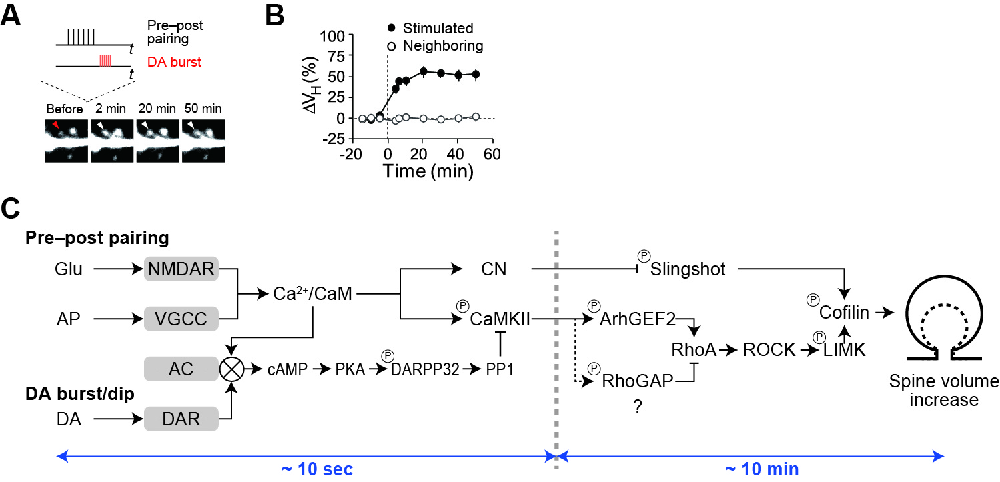

# RhoA model

## System requirements

It requires the toolbox SimBiology on Matlab2022b or later (dictionary variable is used).

## Installation

1. Download source code from the github site:

	- git clone https://github.com/urakubo/ModelRP.git

2. Execute main_sample.m, then the following image will appear.

3. Execute main_fig_timing.m and main_fig_prof.m, and confirm the images of the time windows for RP and the related molecular activities.

 

  

 

## Reference
PLoS Comput Biol 16(7): e1008078.
https://doi.org/10.1371/journal.pcbi.1008078

PLoS Comput Biol 17(9): e1009364.
https://doi.org/10.1371/journal.pcbi.1009364

2022/7/26 Initial submission
